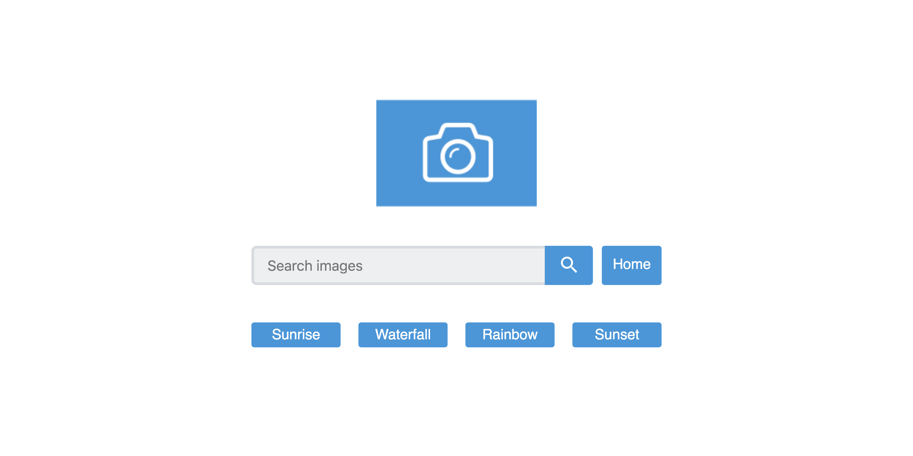

[](https://app.netlify.com/sites/reactgallery/deploys)

# React Gallery App

> An image gallery app using React and the handy Create React App tool to build a fast and lightweight gallery app with a modern approach. This project was bootstrapped with [Create React App](https://github.com/facebook/create-react-app).

## Features

* JavaScript and JSX to build out the gallery components in a modular fashion
* React Router to set up routes for three default topic pages and a search page
* Fetch API to fetch data from the Flickr API and use it to display images

## Technologies

* JavaScript
* React
* CSS
* HTML

## Demo

Active demo: [React Gallery App](https://reactgallery.netlify.com/)

## Screenshot



## Status

Project is: _COMPLETED_

## Inspiration

Treehouse Techdegree: FSJS project 7 - React Gallery App

## Setup

* You’ll need to set up a config.js file in your project (save to src/config.js) that imports your API key into your application so that you and other users can request data from the Flickr API

* The config.js file must look like this:

``` javascript
const apiKey = 'YOUR API KEY';
export default apiKey;
```

## Available Scripts

In the project directory, you can run:

### `npm start`

Runs the app in the development mode.<br>
Open [http://localhost:3000](http://localhost:3000) to view it in the browser.

The page will reload if you make edits.<br>
You will also see any lint errors in the console.

### `npm test`

Launches the test runner in the interactive watch mode.<br>
See the section about [running tests](https://facebook.github.io/create-react-app/docs/running-tests) for more information.

### `npm run build`

Builds the app for production to the `build` folder.<br>
It correctly bundles React in production mode and optimizes the build for the best performance.

The build is minified and the filenames include the hashes.<br>
Your app is ready to be deployed!

See the section about [deployment](https://facebook.github.io/create-react-app/docs/deployment) for more information.

### `npm run eject`

**Note: this is a one-way operation. Once you `eject`, you can’t go back!**

If you aren’t satisfied with the build tool and configuration choices, you can `eject` at any time. This command will remove the single build dependency from your project.

Instead, it will copy all the configuration files and the transitive dependencies (Webpack, Babel, ESLint, etc) right into your project so you have full control over them. All of the commands except `eject` will still work, but they will point to the copied scripts so you can tweak them. At this point you’re on your own.

You don’t have to ever use `eject`. The curated feature set is suitable for small and middle deployments, and you shouldn’t feel obligated to use this feature. However we understand that this tool wouldn’t be useful if you couldn’t customize it when you are ready for it.

## Contact

Created by [@Annes](https://twitter.com/annesCode)